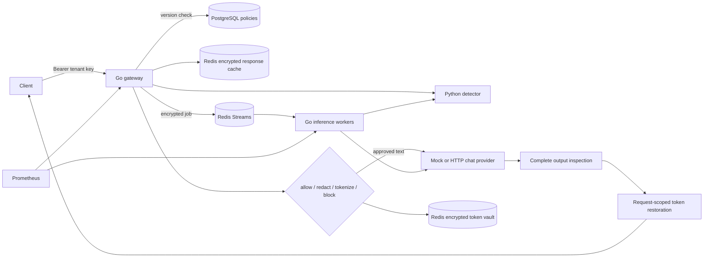
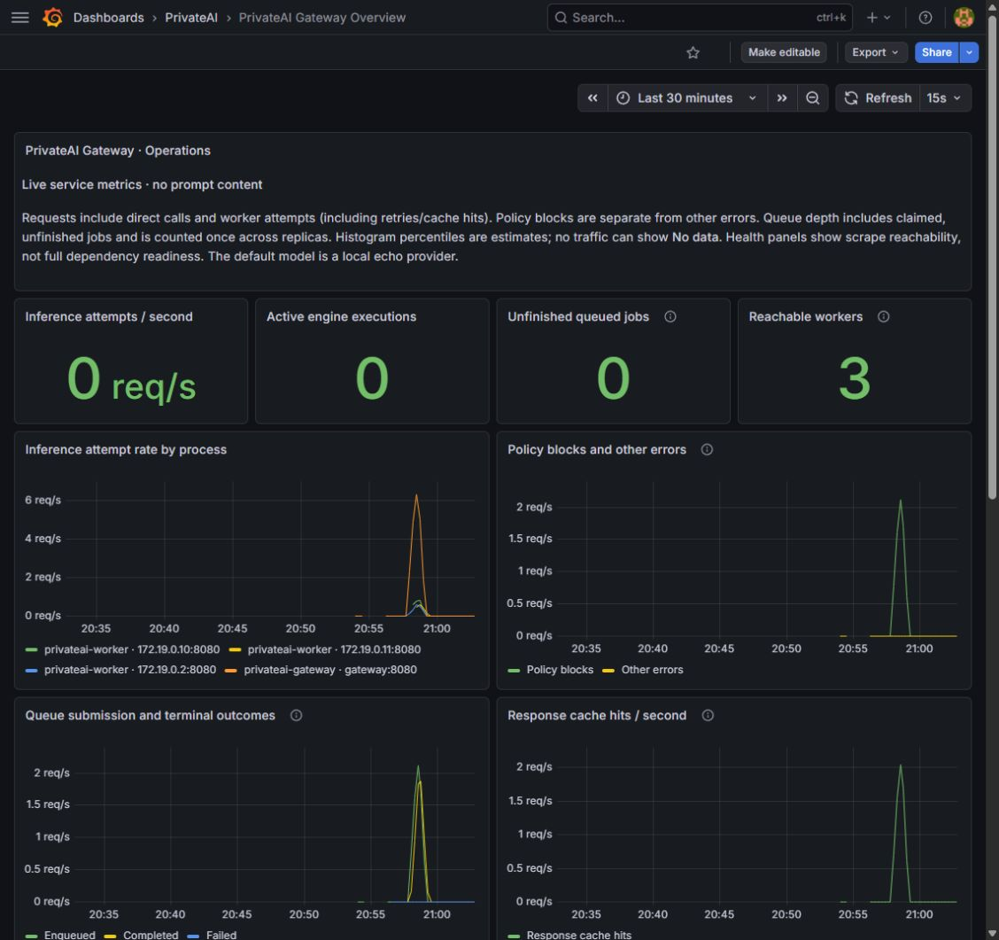

# PrivateAI Gateway

A runnable privacy gateway for text LLM requests: inspect sensitive content, apply tenant policies, replace private values with reversible tokens, and route inference through bounded Go workers. Python provides deterministic PII/secret detection and read-only engineering agents.

**Portfolio implementation, with measured limits.** The default provider is a deterministic local echo service. Client SSE responses use **buffered inspection**: model output is collected and scanned before it is released. This protects against sensitive values split across chunks, but does not provide low-latency token streaming. See [architecture](docs/ARCHITECTURE.md) and [security limits](docs/SECURITY.md).



## Run the full stack

Requires Docker Engine with Compose, and Python 3.11+ for the helper scripts. Python runtime containers use 3.14. No paid model credentials are needed.

```sh
git clone https://github.com/Rohan-Kale/PrivateAI-Gateway.git
cd PrivateAI-Gateway
python scripts/bootstrap.py
docker compose up --build -d --wait
python scripts/client.py chat "Hello, alice@example.com"
python scripts/client.py chat "Hello, alice@example.com" --stream
```

`bootstrap.py` creates random local credentials in ignored `.env` and refuses to overwrite an existing file. The gateway listens at `http://127.0.0.1:8080`; Prometheus is at `http://127.0.0.1:9090`. Datastores and internal Python services have no published host ports. The initial `demo` policy tokenizes emails, blocks secrets, and redacts other recognized PII. Authorized responses restore original email values; the provider receives tokens.

Submit work to the Redis queue, then fetch the returned ID:

```sh
python scripts/client.py submit "Summarize this synthetic document"
python scripts/client.py job JOB_ID
docker compose up -d --scale worker=3
```

Get the current policy, edit it, and submit its current `version`:

```sh
python scripts/client.py policy
python scripts/client.py policy --file examples/policy.json
```

The example starts at version 1. An outdated version returns HTTP 409; get the current version and update the file before retrying. Setting `restore: false` returns opaque tokens to clients. Other tenants have no policy until an administrator creates one with `version: 0`.

```json
{
  "version": 1,
  "default": "redact",
  "rules": {"EMAIL": "tokenize", "SECRET": "block"},
  "restore": true,
  "cache_seconds": 60
}
```

To visualize the running stack, see the optional [Grafana dashboard](docs/GRAFANA.md).
It includes request rates, blocks/errors, queue depth, worker health, cache hits,
latency histograms, and firing Prometheus alerts, provisioned automatically.



*Actual local Prometheus observations from synthetic traffic against the echo
provider with three workers. Captured after the smoke run finished, so current
activity is zero while the charts retain the run's history. This is a dashboard
demonstration, not a real-model performance benchmark.*

## Run without Docker

Requires Go 1.24+ and Python 3.11+. This command builds the gateway, launches isolated loopback detector/mock services, exercises the HTTP API, and stops all child processes:

```sh
python scripts/local_demo.py
python scripts/local_demo.py --benchmark --output results/local-demo.json
```

This mode uses a single-process memory store. It **does not test PostgreSQL, a real Redis server, or distributed workers**. Redis queue logic is separately tested against an in-process Redis test server.

## What is implemented

| Component | Behavior |
|---|---|
| Go gateway | Tenant API keys, strict text-only request schema, admission limit, cancellation, deadlines, connection pooling, JSON and SSE responses |
| Python detector | Email, North American phone, US SSN, Luhn-checked card numbers, selected API-key formats, credential assignments, private-key blocks; UTF-8 byte offsets |
| Policy engine | Per-entity allow/redact/tokenize/block; fail closed on detector errors and malformed spans; input and output inspection |
| Token vault | Random request-scoped tokens, AES-256-GCM encrypted mappings, authenticated tenant/request binding, 10-minute TTL |
| PostgreSQL | Versioned JSONB policies, optimistic concurrency, current-version checks before cached policy use |
| Redis | Version-keyed policy cache, HMAC-keyed encrypted inference cache, encrypted stream jobs/results, bounded queue and retries, abandoned-job recovery |
| Workers | Configurable concurrent Go consumers; at-least-once inference delivery, terminal status, poison-job dead-letter metadata |
| Monitoring | Prometheus request/error/block/cache/inflight/duration and job counters, health/readiness endpoints, alerts |
| Agents | Python issue classification and PR diff checks; optional gateway-generated advisory summaries; no automatic comments, labels, merges, or code execution |
| Deployment | Compose, Kubernetes workloads/PVCs/probes/HPA/PDBs/network policy, Ansible Ubuntu worker provisioning, CI |

## API

Tenant endpoints require `Authorization: Bearer <tenant key>`. Tenant identity comes from the configured key, never from a caller-supplied tenant header.

| Endpoint | Purpose |
|---|---|
| `POST /v1/chat/completions` | `{model, messages:[{role,content}], stream?}`; one text completion |
| `POST /v1/jobs` | Same request without streaming; returns 202 and a job ID |
| `GET /v1/jobs/{id}` | Own tenant's queued/completed/failed job; retained for 24 hours |
| `GET /v1/policy` | Own tenant's effective policy |
| `PUT /admin/policies/{tenant}` | Admin key only; create/update using expected version |
| `GET /healthz` | Process liveness |
| `GET /readyz` | Storage and detector readiness |
| `GET /metrics` | Internal Prometheus endpoint |

Provider integration implements the text-message subset of the common `/v1/chat/completions` HTTP format. Configure `PROVIDER_URL` and `PROVIDER_KEY` in `.env`, set the provider's model with `--model`, and recreate gateway/worker containers. Tools, images, multipart content, arbitrary request options, and multiple choices are rejected. Provider errors are not returned verbatim to clients. Default mock delay is 10 ms.

## Tests and measurements

```sh
go test ./...
go test -race ./...                  # requires a supported C toolchain
go vet ./...
python -m unittest discover -s tests -v
docker compose --profile test run --rm integration
docker compose --profile test run --build --rm database-test
go test -bench . -benchmem -run '^$' ./internal/gateway
python -m benchmarks.detection
```

For a running stack, set `GATEWAY_API_KEY` to your demo key and run `python -m benchmarks.load --concurrency 200 --requests 10000`. The report includes errors, all-response percentiles, observed peak client concurrency, first-byte latency, and raw samples. It is a closed-loop harness, not an open-loop capacity test.

The recorded local run completed **10,000/10,000** measured HTTP requests across five scenarios. At a measured peak of 200 simultaneous client requests, the 2,000-request mock/memory burst reported **2,387 successful requests/s and 387 ms p95**. This is not a real-model or distributed deployment performance claim. The detector found **13 of 16 labeled entities** in a tiny synthetic corpus (three known unsupported cases); there is no claim of general 99% detection accuracy. Read the complete [benchmark report](docs/BENCHMARKS.md), including initial failed runs and environment details.

## Deployment and engineering agents

- [Deployment guide](docs/DEPLOYMENT.md): Compose lifecycle, Kubernetes images and secrets, Ansible workers, operational checks.
- [Architecture](docs/ARCHITECTURE.md): policy consistency, cache design, queue recovery, streaming tradeoff.
- [Security and limitations](docs/SECURITY.md): trust boundaries, retention, unsupported detection, production gaps.
- [Verification status](docs/VERIFICATION.md): what was actually run and what remains unverified.

```sh
python -m agents.issue_triage examples/issue.json --output work/triage-report.json
python -m agents.pr_check --diff examples/change.diff --output work/pr-report.json
```

Add `--llm` with `GATEWAY_API_KEY` set for an optional sanitized advisory summary. Deterministic decisions remain separate from untrusted model prose. GitHub workflows produce artifacts with read-only repository permissions; they do not post messages or change labels.

This repository began empty. Implementation and measurements are committed in separate checkpoints so the build and validation history is inspectable.
